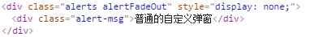
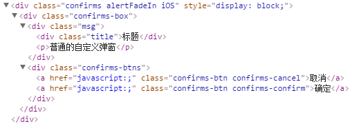
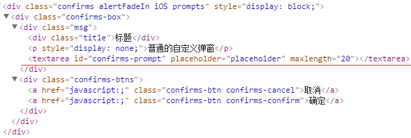

# alertBox
移动端自定义iOS，安卓弹出层。

### 说明：
 
 @ 原生移动端自定义弹出层，不依赖`zepto`。   
 
 @ 用法  
 
   1、可以直接`@import alertBox.scss`，也可以引入css文件。`自定义样式详见页脚`    
   2、引入`alertBox.js`文件。    
   3、需设置根字体大小，样式单位用的rem，并设置`meta viewport`。
    
 ```html
 <meta name="viewport" content="width=device-width,
      initial-scale=1, maximum-scale=1, minimum-scale=1, user-scalable=no">
 <link rel="stylesheet" href="style/alertbox.css">
 <script src="alertBox.js"></script>
 ```
 ```js
  var dpi = window.devicePixelRatio;
  var clientWidth = "";
  var t = null;
  var fontsize = document.body.clientWidth / 10;

  if (dpi != 1) {
    var obj = document.head.getElementsByTagName("meta")[1];
    var n = 1 / dpi;
    obj.content = "width=device-width,initial-scale="+n+", maximum-scale="+n+", minimum-scale="+n+", user-scalable=no";
  }

  t = window.setInterval(function () {
    clientWidth = document.body.clientWidth;
    if (clientWidth != 0) {
      clearInterval(t);
      fontsize = clientWidth / 10;
      document.documentElement.style.fontSize = fontsize + 'px';
    }
  }, 10);
 ```
 
 @ 功能   
 
   * 1、普通弹窗 `@params 提示字符窜，自定义时间后消失` 
   * 2、警告框   `@params 提示字符窜，弹窗标题（默认为*提示*）`     
   * 3、prompt   `@params 文本输入placeholder，弹窗标题（默认为*提示*）`      
      
@ 初始化
 
 ```js
 var AlertBox = new AlertBox(
  {
    debug: false, //开启后，在安卓中也显示iOS弹窗
    alertBoxKeepTime: 500, //普通弹窗显示时间
    promptMaxlength: 20 //prompt文本输入的最大长度
  }
);
```
@例子：

1、普通弹窗
```js
AlertBox.alerts("222");
```

3、警告框
```js
AlertBox.confirms("提示文字", "标题");
```

4、prompt
```js
AlertBox.confirms("placeholder文字", "标题");
```

====================================================================================

@关于自定义样式，可以根据dom结构从新设计样式，`DOM`结构分别如下：

alerts  



confirms 



prompts 




@ authur [JmingZI](http://ymblog.net)

@ date 2016-2-29
