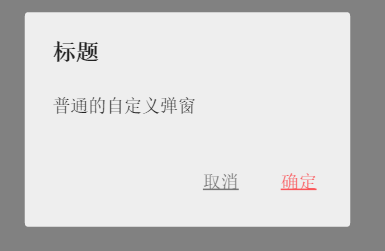
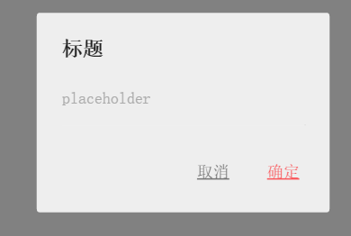
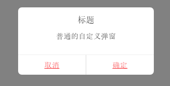
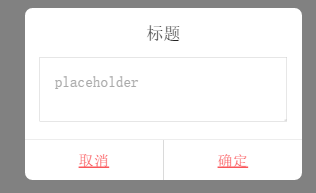

# alertBox
移动端自定义iOS，安卓弹出层。


安卓  



iOS 



### 说明：
 
 @ 原生移动端自定义弹出层，不依赖`zepto`。   
 
 @ 用法  
 
   1、可以直接`@import "alert"`，也可以引入css文件。`自定义样式详见页脚`    
   2、引入`alerts.js`文件。    
   3、需设置根字体大小，样式单位用的rem，并设置`meta viewport`，详细参见[common-components首页之](https://github.com/JMingZI/common-components) [移动端自适应屏幕方案：set-viewport](https://github.com/JMingZI/common-components/blob/master/set-viewport/index.js)。
    
 ```html
 <head>
    <script src="alerts.js"></script>
 </head>
 ```
 @ 功能   
  
   * 1、toast `@params str` 
   * 2、普通弹窗 `@params str + confirm text` 
   * 3、警告框   `@params str + title + confirm text + confirmCallback`     
   * 4、prompt   `@params placeholder + title + confirm text + confirmCallback`      
      
@ 初始化
 
 ```js
 var AlertBox = new AlertBox(
  {
    debug: false, //开启后，在安卓中也显示iOS弹窗
    alertBoxKeepTime: 500, //普通弹窗显示时间
    promptMaxlength: 20 //prompt文本输入的最大长度
  }
);
```
@例子：

1、toast

```js
alertbox.toasts("普通的toast");
```

2、普通弹窗

```js
alertbox.alerts("普通的弹窗");

alertbox.alerts("普通的弹窗", "按钮");
```

3、警告框

```js
alertbox.confirms("普通的警告窗1");

alertbox.confirms("普通的警告窗2", "标题没有默认值", "我是确定按钮"
    , function () { 
        alertbox.toasts("我是confirms回调") 
      }
);
```

4、prompt

```js
alertbox.prompts("placeholder1");

alertbox.prompts("placeholder2", "标题没有默认值", "我是确定按钮"
    , function () { 
        alertbox.toasts("我是prompts回调") 
      }
);
```

====================================================================================

@关于自定义样式，可以根据dom结构从新设计样式，`DOM`结构分别如下：

alerts  


confirms 


prompts 


@ authur [JmingZI](http://ymblog.net)

@ date 2016-2-29 / First modified at 2016/10/12
